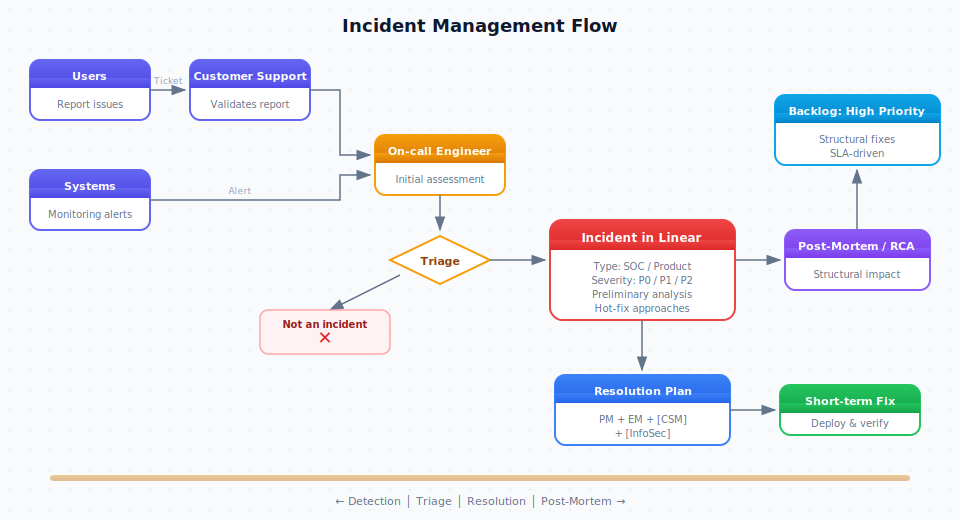

# Incident Management Process

## Objective

Establish a clear and efficient process for identifying, escalating, and communicating product-related incidents to ensure timely resolution, minimize user impact, and maintain transparency across all relevant teams.

## Overview

When a member of the product or engineering team encounters a potential incident (a problem that could significantly affect a substantial number of users, or an unexpected spike in cloud infrastructure costs) the following process outlines the roles, responsibilities, and communication pathways to ensure swift and effective incident resolution.

## Goals

1. **Minimize Negative Impact:** Quickly identify and implement measures to reduce or eliminate adverse effects on users, systems, and business operations.
2. **Swift Detection and Reporting:** Ensure incidents are reported as soon as they are recognized.
3. **Immediate Mitigation:** Once the incident is detected, we have an efficient process to mitigate the problem as soon as possible.
4. **Efficient Triage and Investigation:** Assign the most capable resources to determine root causes and potential solutions.
5. **Clear Internal Communication:** Keep relevant stakeholders (Engineering, Product Management, Customer Support, Customer Success, and other teams) informed about the incident's status and potential business impact.
6. **Timely External Communication:** If necessary, communicate proactively to customers through the appropriate channels, supported by the Customer Success team.

## Roles and Responsibilities

| Role | Responsibilities |
|------|-----------------|
| **Engineering Manager (EM)** | Oversees resource assignment and prioritization. Coordinates with Product Management for broader communication and decision-making. Provides executive oversight and support for incident resolution. |
| **Senior Developer (SD)** | Primary owner of incident triage and technical leadership. Takes charge of technical investigation, identifies required technical resources, and works closely with the EM and Product Manager to plan and execute the resolution strategy. |
| **Platform Engineering Team** | Engaged for any incident involving infrastructure, deployments, pipelines, observability tooling, or cloud resources. Owns rollback execution, infrastructure diagnostics, and monitoring. Supports product teams with Datadog, alerting, and deployment recovery. |
| **Product Manager (PM)** | Evaluates business impact and communicates it to other product and cross-functional teams. Aligns incident resolution strategies with product roadmap and overall business objectives. Leads cross-team communication. |
| **InfoSec Team** | Engaged immediately for any potential security-related incidents. Provides guidance on security best practices and compliance requirements. Coordinates with external security resources if needed. |
| **Customer Support** | Informed proactively if incident may cause an uptick in support inquiries. Coordinates with PM to ensure accurate messaging to customers if direct communication is needed. |
| **Customer Success (CS)** | Engaged if and when direct customer communication or recovery planning (apologies, status updates) is required. |

## Incident Severity Levels

| Level | User Impact | Financial Impact | Customer Impact | Examples | Response |
|-------|------------|-----------------|-----------------|----------|----------|
| **P0 (Critical)** | >20% of users unable to access core functionality | >100% unexpected increase in cloud costs | >25% of customers affected | Complete service outage, data loss, security breach | Immediate all-hands response |
| **P1 (High)** | 10-20% of users experiencing severe disruption | 50-100% unexpected increase in cloud costs | 10-25% of customers affected | Major feature breakdown | Same-day response |
| **P2 (Medium)** | 5-10% of users experiencing issues | 30-50% unexpected increase in cloud costs | 5-10% of customers affected | Non-critical feature issues, intermittent problems | Next business day response |
| **P3 (Low)** | <5% of users experiencing minor issues | — | <5% of customers affected | UI glitches, minor bugs, performance edge cases | Scheduled fix in upcoming sprint |

## Process

### 1. Detection & Initial Reporting

**Trigger:** Any team member observes or suspects a problem that could significantly impact users.

**Action:** The observer immediately notifies the Engineering Manager and/or a Senior Developer from the affected product area. If the incident involves infrastructure, deployments, or monitoring, the Platform Engineering team is also notified immediately.

**Role Assignment:** Upon incident declaration, the following roles must be immediately assigned:

| Role | Assigned To | Responsibilities |
|------|-------------|-----------------|
| **Incident Coordinator** | Engineering Manager or designated Senior Developer | Coordinate overall incident response, track action items and follow-ups, ensure clear communication channels are established |
| **Technical Lead** | Senior Developer | Lead technical investigation and resolution, coordinate engineering resources |
| **Infrastructure Lead** | Platform Engineer | Own infrastructure diagnostics, rollback execution, deployment pipeline issues, and monitoring. Provide Datadog dashboards and logs to the Technical Lead |
| **Communications Lead** | Product Manager | Manage all internal and external communications, coordinate with Customer Success and Support teams, keep stakeholders informed |

**Escalation:** If the Senior Developer is informed first and the EM/PM is temporarily unreachable, the Senior Developer must contact the EM or PM as soon as possible.

### 2. Initial Assessment & Triage

Led by the Senior Developer, with the Platform Engineering team providing infrastructure context. Once informed, they promptly:

- Investigate initial signals to confirm if the issue is real and estimate its scope
- Platform Engineering checks deployment status, recent changes, infrastructure health, and Datadog alerts to rule in or out infrastructure as a cause
- Categorize the incident using the severity levels above
- Identify the best-qualified engineers to address the problem
- Collaborate with the EM/PM to prioritize the incident and allocate resources

### 3. Root Cause Analysis & Action Planning

- The assigned engineers work on identifying the root cause and propose immediate remediation steps
- If the root cause is infrastructure or deployment-related, Platform Engineering leads the fix (rollback, config change, scaling) and keeps the Technical Lead informed
- If the root cause is application code, the Senior Developer leads the fix with Platform Engineering on standby for deployment support
- The Senior Developer communicates findings to the EM and Product Manager
- The EM and Product Manager discuss next steps, including potential workarounds, system rollbacks, or code fixes

### 4. Cross-Functional Communication

**To Other Product Teams:** Once the problem is understood, the EM or PM informs other relevant product and engineering teams with:

- What the issue is and its root cause (if known)
- Expected timelines for a fix or workaround
- Potential side effects on features or user flows in their areas

**To Customer Support:** If there is a likelihood of increased support inquiries, the PM (in coordination with the EM) provides:

- A concise incident description
- Potential troubleshooting steps or workaround instructions for customers

**To Customer Success:** If the incident requires direct communication to affected customers, the PM and Customer Success collaborate to:

- Draft and approve customer-facing messages
- Plan the timing and method of outreach (email, in-app notification, etc.)

### 5. Resolution & Post-Mortem

- Once the fix is deployed, Platform Engineering monitors infrastructure metrics and deployment health to confirm the resolution is stable
- The product team verifies the resolution from a user-facing perspective
- The EM and PM provide a final update to all stakeholders
- A post-mortem meeting is conducted with all involved parties including Platform Engineering. If the incident exposed infrastructure or observability gaps, Platform Engineering owns the follow-up action items
- Complete the post-mortem using the template below

---

## Post-Mortem Template

Use this template for every P0 and P1 incident. P2 incidents should use it when the root cause is unclear or cross-team. Copy this into a new document for each incident.

### Description

Provide a short description of the incident that occurred.

> _Example: "Payment processing service returned 500 errors for all transactions in the EU region for approximately 45 minutes."_

### Timeline Review

Walk through the incident timeline from detection to resolution. Highlight key events: detection method, initial response steps, mitigation attempts, and final fix.

!!! note "For Tech Support"
    Please input steps taken to validate incident status before escalating to engineering.

| Date | Time | Description | Personnel Involved | Actions Taken |
|------|------|-------------|--------------------|---------------|
|      |      |             |                    |               |
|      |      |             |                    |               |
|      |      |             |                    |               |

### Impact Analysis

Assess the scope of impact on systems, clients, users, or third parties.

| Dimension | Affected? | Details |
|-----------|-----------|---------|
| **Confidentiality:** The confidentiality of a system (and therefore its data) has been compromised | Yes / No | |
| **Integrity:** The completeness, accuracy, or timeliness of data has been compromised | Yes / No | |
| **Availability:** The availability of data or services has been compromised | Yes / No | |

**Blast radius:**

- Users affected: _number or percentage_
- Customers affected: _number or percentage_
- Revenue impact: _estimated or N/A_
- Duration: _total time from detection to resolution_

### Containment

Describe the actions taken to contain the incident and prevent further damage while a permanent fix was developed.

### Root Cause Analysis

Provide an analysis of how and why the incident occurred. Use the "5 Whys" technique if helpful.

1. **What happened?**
2. **Why did it happen?**
3. **Why wasn't it caught earlier?**
4. **What was the contributing cause?**
5. **What was the underlying systemic cause?**

### Resolution

Describe the actions taken to resolve the incident. Include any configuration changes, code deployments, or infrastructure modifications.

### Related Incidents

Link any related past incidents here. Check Datadog Incident Management or PagerDuty for similar incidents that share matching services, tags, or error signatures.

| Incident | Date | Similarity |
|----------|------|------------|
|          |      |            |

### Areas for Improvement

| Category | Details |
|----------|---------|
| **What worked well** | |
| **What didn't work well** | |
| **Lessons learned** | |

**Action items:**

| Action | Owner | Due Date | Status |
|--------|-------|----------|--------|
|        |       |          | ☐ Open |
|        |       |          | ☐ Open |
|        |       |          | ☐ Open |

