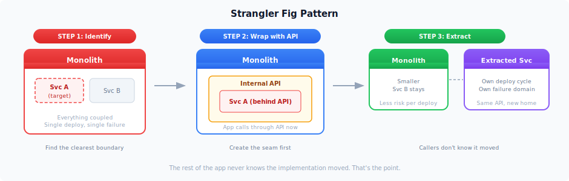
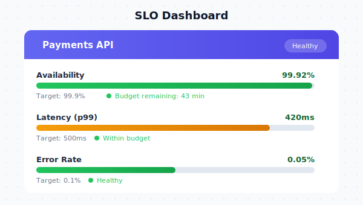

# Month 3: Scale & Strategy

Phase 4 of 4. Builds on the acceleration work from [Month 2](month-2.md). See the [timeline overview](README.md) for the full plan.

## Goals

- Extract one bounded context as a proof-of-concept service
- Deliver SLO dashboards with error budgets to all teams
- Present 6-12 month roadmap to leadership
- Make on-call sustainable (not heroic)

## Activities by Owner

### Me

| Activity | Ships |
|----------|-------|
| Identify 3-5 domain boundaries via dependency analysis | Domain analysis document |
| Extract one bounded context as a separately deployable service | Working service with its own deploy pipeline |
| Present 6-12 month roadmap to leadership | Approved plan with milestones |
| Lead the microservices conversation with CEO | Data-backed phased proposal |
| Formal leadership review against agreed success metrics | Compare results to the 3-5 metrics we locked in during Week 2 |

### Engineer A

| Activity | Ships |
|----------|-------|
| Build SLO dashboards visible to all teams | Datadog dashboards with error budget tracking |
| Automate remaining manual deployment steps | Target: zero-touch deploys |

### Engineer B

| Activity | Ships |
|----------|-------|
| Complete access management automation | HIPAA-ready audit logging |
| Build developer self-service portal | Common infra requests without filing tickets |
| Ship status page if one doesn't exist | Statuspage.io or similar, customers need to know when the system is down |
| Run developer satisfaction survey | Compare to Week 2 baseline, track what's still slowing people down |

## Domain Boundary Analysis

To extract a service, we need to identify where the natural seams are. Criteria I'd use:

| Criteria | Weight |
|----------|--------|
| Owns its own data (separate tables, minimal joins to other domains) | High |
| Has clear API boundaries (well-defined interface to the rest of the app) | High |
| Aligns with team ownership (one team owns it end-to-end) | High |
| Different scaling needs than the monolith | Medium |
| Changes frequently (benefits from independent deploy cadence) | Medium |

Likely candidates (to be validated during discovery):

| Domain | Independence | Extraction Difficulty | Notes |
|--------|-------------|----------------------|-------|
| Notifications | High | Low | Good first candidate: low risk, clear boundary |
| Payments/Billing | High | Medium | High value but needs careful data handling (PHI-adjacent) |
| Reporting/Analytics | Medium | Low | Read-heavy, could be separated cleanly |
| User Auth | High | High | Too critical for a first extraction |
| Core Scheduling | Low | Very High | Too coupled, defer until later |

## Service Extraction: Strangler Fig Pattern

The approach: wrap the target domain with an internal API inside the monolith first, then extract it behind that API. This way the rest of the app doesn't care where the implementation lives.

## SLO Dashboard Design

Per-service view showing availability, latency, error rate against targets, with remaining error budget:

Error budget policy:

| Budget Remaining | What We Do |
|------------------|------------|
| > 50% | Ship freely |
| 25-50% | Extra review for risky changes |
| 10-25% | Only critical fixes |
| < 10% | Freeze deploys, focus on reliability |

## 6-12 Month Roadmap (Preview)

This is what I'd present to leadership at the end of Month 3, backed by the results from the first 90 days:

**Months 4-6:** Extract 2-3 additional services. Establish distributed tracing across services. Service mesh if inter-service communication warrants it.

**Months 7-9:** Self-service infrastructure provisioning. Automated compliance scanning. Cost optimization (if it becomes relevant at scale).

**Months 10-12:** Chaos engineering practice. Multi-region deployment capability if business needs dictate.

## Deliverables by End of Month 3

| Deliverable | Target |
|-------------|--------|
| Services extracted | 1 (proof-of-concept with its own deploy pipeline) |
| SLO dashboards | Live for all teams with error budgets |
| On-call sustainability | Confirmed via team feedback |
| 6-12 month roadmap | Presented and approved |
| DORA metrics | Baseline established and trending up |
| Leadership review | Results measured against agreed success criteria |
| Developer satisfaction survey | Completed and compared to Week 2 |
| Status page | Live (if it didn't exist) |

## DORA Metrics (Baseline vs. Target)

| Metric | Day 1 | Day 90 Target |
|--------|-------|---------------|
| Deployment Frequency | 1/day | 2-3x/day (stretch: 5+/day) |
| Lead Time for Changes | Days | Hours |
| Mean Time to Recovery | Hours | < 1 hour (stretch: < 30 min) |
| Change Failure Rate | High (2 Sev-1s last month) | < 5% |
