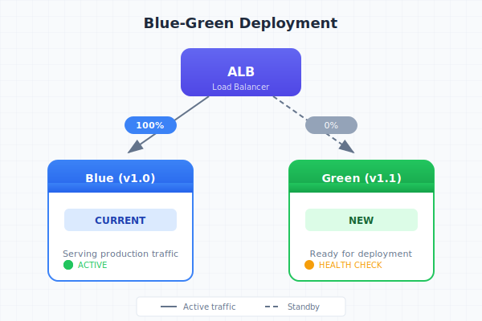
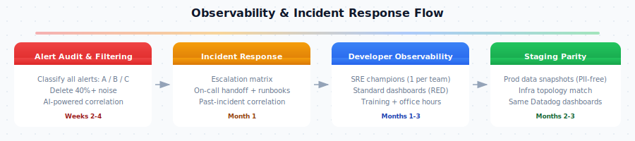
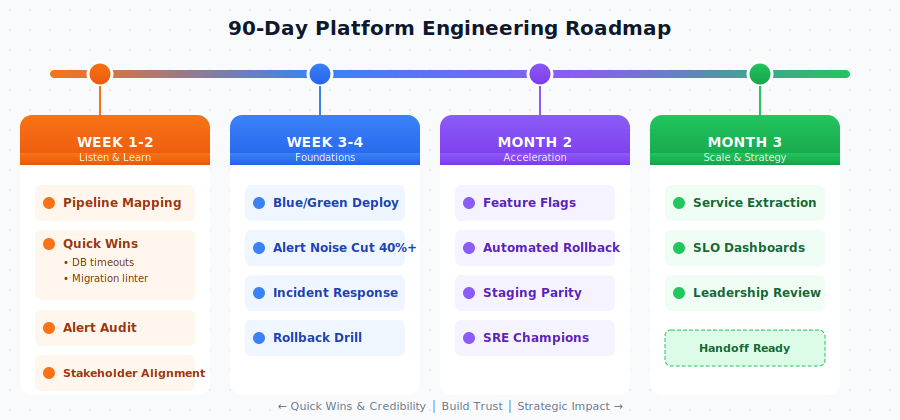

# Platform Engineering: 90-Day Plan

**Amanda Souza** · Senior Platform Engineer · February 2026

---

## The Problem

Last month we had two Sev-1 incidents, both caused by deployments. Deploys take 4 hours, which blocks engineers from merging and costs us roughly 50-75 engineer-hours per week. On-call can't keep up with alert noise, and only 3 people in a 50-person org know how to debug production.

## Proposal 1: Safe & Fast Deployment Pipeline

Deployments are the single biggest bottleneck. 4-hour cycles, 50 engineers waiting, and the two Sev-1s both came from DB migrations that went wrong. We fix this with blue/green deployments, a migration linter and lock timeouts in CI, feature flags, and automated rollback.

~4 weeks of work, me and one engineer.

| Metric | Today | Target | Stretch |
|--------|-------|--------|---------|
| Deploy time | ~4 hours | **< 1 hour** | < 30 min |
| Sev-1 from deploys | 2/month | **0** | — |
| Deploy frequency | 1x/day | **2-3x/day** | 5+/day |
| Engineers blocked | ~50 | **0** | 0 |

## Proposal 2: Observability & Incident Response

On-call gets paged constantly but half the alerts don't have a clear action. Meanwhile, if something breaks in production, the same 3 people get pulled in every time because nobody else knows how to use Datadog. We audit and clean up alerts, write runbooks for the ones that matter, set up an SRE champions program so each team has someone who can actually debug prod, and fix staging so it reproduces real issues.

~3 weeks of work, me and one engineer.

| Metric | Today | Target | Stretch |
|--------|-------|--------|---------|
| Actionable alerts | Unknown (low) | **> 80%** | > 90% |
| MTTR (Sev-1) | Hours | **< 1 hour** | < 30 min |
| Engineers who debug prod | ~3 | **15-20** (SRE champions) | All 50 (6-mo) |
| Staging reproduces prod | Rarely | **60-70%** | 80%+ |

## 90-Day Roadmap

| Phase | When | Key Deliverables |
|-------|------|-----------------|
| **Listen & Learn** | Week 1–2 | Pipeline mapped, DB timeouts + migration linter live, alert audit complete, stakeholder alignment |
| **Foundations** | Week 3–4 | Blue/green deploys, deploys < 1 hr, 40%+ alert noise cut, incident response framework, rollback drill |
| **Acceleration** | Month 2 | Feature flags operational, automated rollback, staging parity, SRE champions trained |
| **Scale** | Month 3 | 1 service extracted, SLO dashboards, leadership review against success criteria |

## Team

| Person | Focus |
|--------|-------|
| **Me** | Pipeline architecture, blue/green, feature flags, service extraction, leadership alignment |
| **Engineer A** | Alert audit, runbooks, deployment automation, SLO dashboards |
| **Engineer B** | Access automation, staging parity, developer self-service |

## Top Risks

| Risk | What we do about it |
|------|---------------------|
| Scope creep from ad-hoc requests | Strict prioritization, weekly review with manager |
| Engineer pulled to other work | Highest-impact items first; defer, don't dilute |
| Resistance to new deploy process | We ship unblocked PRs and faster merges first. Once engineers feel that, they're on board |

## Why This Order

Deployments first because nothing else works without a reliable pipeline. You can't run microservices if every deploy takes 4 hours. You can't improve reliability if only 3 people can see what's happening in prod. We get quick wins on the board in month 1, which gives us credibility to push the harder changes in months 2 and 3.

---

**This document is a snapshot.** I believe documentation should be living, it evolves every time I get new feedback, learn something from the team, or hit something I didn't anticipate. That's why I built the full plan as a web page rather than a static PDF. This one-pager gives you the headlines, BUT the site gives you the full depth, and it'll keep getting better.

**For the full plan (proposals, roadmap, technical details, appendix) visit the docs site.**

